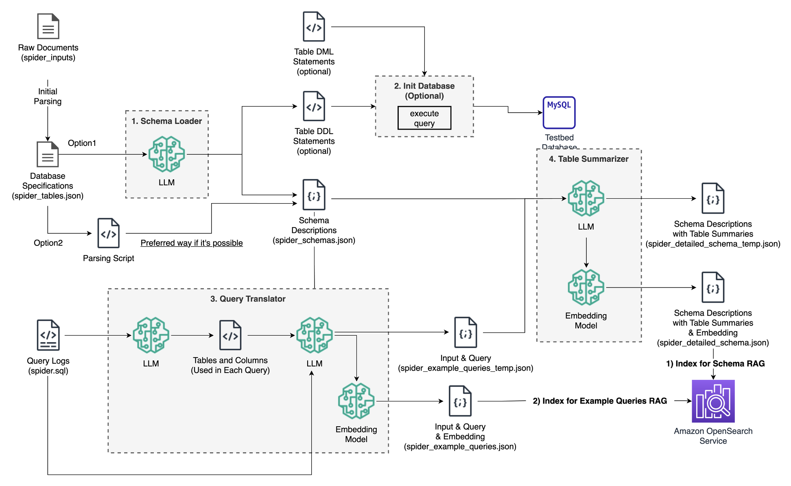

# Overview



1. [Schema Loader](https://github.com/kevmyung/db-schema-loader/tree/main?tab=readme-ov-file#schema-loader)
   - Automatically generates database schema definition documents using a simple table description file.
2. [Init Database](https://github.com/kevmyung/db-schema-loader/tree/main?tab=readme-ov-file#init-database)
   - Uses the database schema definition to initially configure the test MySQL database schema and load sample data.
3. [Query Translator](https://github.com/kevmyung/db-schema-loader/tree/main?tab=readme-ov-file#query-translator)
   - Translates example SQL queries into natural language and converts them into vector embeddings for indexing in OpenSearch.
4. [Table Summarizer](https://github.com/kevmyung/db-schema-loader/tree/main?tab=readme-ov-file#table-summarizer)
   - Uses sample queries and basic table descriptions to augment a summary of how each table can be used, and converts this into vector embeddings for indexing in OpenSearch.

# Schema Loader
The `schema_loader.py` script generates a database schema definition from a predefined JSON file. This script outputs SQL Data Definition Language (DDL) statements to create tables in the database and detailed schema descriptions in JSON format.

## Input

- JSON file containing table and column information. It processes each table iteratively with no specific format for internal field structure. (Example - `spider_tables.json`)
    ```json
    {
        "table_name": {
            "...": "table description",
            "...": [
                {
                    "col": "column name",
                    "format": "data format",
                    "col_desc": "column description",
                    "pk": true or false
                },
                ...
            ]
        },
        ...
    }
    ```

## Output

- Table DDL statements: SQL DDL statements to create tables defined in `spider_tables.json`. (Example - `./metadata/spider_table_DDLs.sql`)
    ```sql
    CREATE TABLE IAWD_TB_DCWBWR_WBL_M (WBL_NO VARCHAR(60),COC_DT VARCHAR(8));
    ```
- Schema description file: JSON file containing detailed schema descriptions. (Example - `./metadata/spider_schemas.json`)
    ```json
    {
        "IAWD_TB_DCWBWR_WBL_M": {
            "table_desc": "Contains basic information about each waybill, including waybill number and collection date.",
            "cols": [
                {
                    "col": "WBL_NO",
                    "col_desc": "Unique number for the waybill."
                },
                {
                    "col": "COC_DT",
                    "col_desc": "Collection date of the waybill."
                }
            ]
        },
        ...
    }
    ```

# Init Database
The `init_database.py` script initializes the MySQL database using the DDL statements generated by the `schema_loader.py` script. It then loads sample data into the tables.

## Input

- Schema DDL statements file: SQL file with DDL statements to create tables. (Example - `./metadata/spider_table_DDLs.sql`)
- Sample data file: CSV files containing sample data to be loaded into the tables. (Example - `./data/sample_data.csv`)

## Output

- Initialized database with the schema defined and sample data loaded.

## Usage

1. Ensure the input files are correctly formatted and located in the appropriate directories.
2. Run the `init_database.py` script:
    ```sh
    python init_database.py
    ```

# Query Translator
The `query_translator.py` script translates example SQL queries into natural language descriptions and converts them into vector embeddings for indexing in OpenSearch.

## Input

- Example SQL queries file: JSON file containing example SQL queries and their natural language descriptions. (Example - `./metadata/example_queries.json`)
    ```json
    {
        "input": "Retrieve all artist information",
        "query": "SELECT * FROM Artist"
    }
    ```

## Output

- Indexed vector embeddings in OpenSearch.

## Usage

1. Ensure the input files are correctly formatted and located in the appropriate directories.
2. Run the `query_translator.py` script:
    ```sh
    python query_translator.py
    ```

# Table Summarizer
The `table_summarizer.py` script generates augmented summaries of how each table can be used, based on sample queries and basic table descriptions, and converts these into vector embeddings for indexing in OpenSearch.

## Input

- Sample queries and table descriptions file: JSON file containing sample queries and basic table descriptions. (Example - `./metadata/table_descriptions.json`)
    ```json
    {
        "Album": {
            "table_desc": "Stores album data with unique ID, title, and links to artist via artist ID.",
            "cols": [
                {
                    "col": "AlbumId",
                    "col_desc": "Primary key, unique identifier for the album."
                },
                {
                    "col": "Title",
                    "col_desc": "Title of the album."
                },
                {
                    "col": "ArtistId",
                    "col_desc": "Foreign key that references the artist of the album."
                }
            ]
        },
        ...
    }
    ```

## Output

- Detailed table summary file - temporary: Stores the temporarily generated table summaries.
    ```json
    {
        "Album": {
            "table_desc": "...",
            "cols": [
                {"col": "AlbumId", ...}
            ],
            "table_summary": "This table stores album data, including a unique ID, title, and artist ID which links to the artist table as a foreign key.\\n\\nYou can use this table for analyses such as:\\n\\n1. Retrieving the entire list of albums for a specific artist.\\n2. Aggregating the number of albums per artist.\\n3. Statistical analysis of the number of tracks per album.\\n4. Analyzing the active period and productivity of artists.\\n5. Identifying popular artists/albums for recommendation systems.\\n6. Using as a reference for planning artist/album-related content and products.\\n\\nThis table provides essential data for constructing artist profile pages on music streaming services or online music sales platforms, creating artist-related content, and developing personalized recommendation systems or marketing strategies."
        }
    }
    ```
- Detailed table summary file - final: Stores the final table summaries with embeddings.
    - Adds a `table_summary_v` field to store the embedding of `table_summary`.

## Usage

1. Ensure the input files are correctly formatted and located in the appropriate directories.
2. Run the `table_summarizer.py` script:
    ```sh
    python table_summarizer.py
    ```
